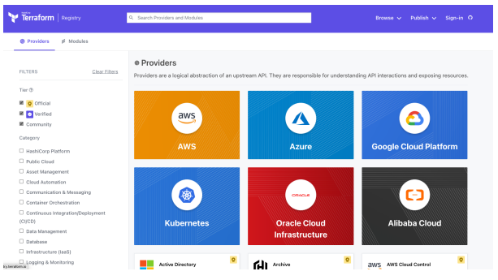
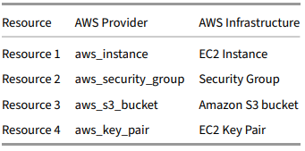

#
Lab: Terraform Plug-in Based Architecture
#
Terraform relies on plugins called “providers” to interact with remote systems and expand functionality. Terraform configurations must declare which providers they require so that Terraform can install and use them. This is performed within a Terraform configuration block.
#

• Task 1: View available Terraform Providers

• Task 2: Install the Terraform AWS Provider

• Task 3: View installed and required providers

#
Task 1: View available Terraform Providers
#
Terraform Providers are plugins that implement resource types for particular clouds, platforms and generally speaking any remote system with an API. Terraform configurations must declare which providers they require, so that Terraform can install and use them. Popular Terraform Providers include: AWS, Azure, Google Cloud, VMware, Kubernetes and Oracle.

For a full list of available Terraform providers, reference the Terraform Provider Registry

#
Task 2: Install the Terraform AWS Provider
#
To install the Terraform AWS provider, and set the provider version in a way that is very similar to how you did for Terraform. To begin you need to let Terraform know to use the provider through a required_providers block in the terraform.tf file as seen.

#
Lab: Configure Terraform AWS Provider
#

Use the Amazon Web Services (AWS) provider to interact with the many resources supported by AWS. You must configure the provider with the proper credentials before you can use it.

• Task 1: Check Terraform AWS provider version

• Task 2: Configure Terraform AWS Provider

Task 1: 

Check Terraform version

Run the following command to check the Terraform version:

terraform -version

Task 2: Configure Terraform AWS Provider

Edit the provider block within the main.tf to configure the Terraform AWS provider.

terraform.tf

Configure the AWS Provider

provider "aws" {

region = "us-east-1"

}

This informs Terraform that it will deploy services into the us-east-1 region within AWS.

Task 2: Configure AWS Credentials for Terraform provider

The AWS Terraform provider offers a flexible means of providing credentials for authentication. The following methods are supported:

Static credentials:

Static credentials can be provided by adding an access_key and secret_key in-line in the AWS provider

block:

provider "aws" {

region = "us-east-1"

access_key = "my-access-key"

secret_key = "my-secret-key"

}

Environment variables:

You can provide your credentials via the AWS_ACCESS_KEY_ID and AWS_SECRET_ACCESS_KEY, environment variables, representing your AWS Access Key and AWS Secret Key, respectively.

terraform.tf file

 provider "aws" {

}

run Below command on vsCode make sure to replace access key and secret key with your AWS credentials.

$ export AWS_ACCESS_KEY_ID="a_accesskey"

$ export AWS_SECRET_ACCESS_KEY="a_secretkey"

$ export AWS_DEFAULT_REGION="region"

#
Terraform Resource Blocks
#

Terraform uses resource blocks to manage infrastructure, such as virtual networks, compute instances, or higher-level components such as DNS records. Resource blocks represent one or more infrastructure objects in your Terraform configuration. Most Terraform providers have a number of different resources that map to the appropriate APIs to manage that particular infrastructure type. 
 
# Template 

< BLOCK TYPE > "< BLOCK LABEL >" "< BLOCK Name >" { 

# Block body 

< IDENTIFIER > = < EXPRESSION > # Argument 

} 

When working with a specific provider, like AWS, Azure, or GCP, the resources are defined in the provider documentation. Each resource is fully documented in regards to the valid and required arguments required for each individual resource. For example, the aws_key_pair resource has a “Required” argument of public_key but optional arguments like key_name and tags. You’ll need to look at the provider documentation(https://registry.terraform.io/providers/hashicorp/aws/latest/docs/resources) to understand what the supported resources are and how to define them in your Terraform configuration.  

Important - Without resource blocks, Terraform is not going to create resources. All of the other block types, such as variable, provider, terraform, output, etc. are essentially supporting block types for the resource block

#

Lab Test: 

• Task 1: View and understand an existing resource block in Terraform  

• Task 2: Add a new resource to deploy an Amazon S3 bucket  

• Task 3: Create a new AWS security group  

• Task 4: Configure a resource from the random provider  

• Task 5: Update the Amazon S3 bucket to use the random ID 
#
Task 1: View and understand an existing resource block in Terraform  
#
Using the main.tf created in previous labs, look for a resource block that deploys a route table. The code should look something like this: 

resource "aws_route_table" "public_route_table" { 

vpc_id = aws_vpc.vpc.id 

route { 

cidr_block = "0.0.0.0/0" 

gateway_id = aws_internet_gateway.internet_gateway.id 

} 

tags = { 

Name = "demo_public_rtb" 

Terraform = "true" 

} 

} 

Let’s look at the details in this resource block. First, all resource blocks will be declared using the resouce block type. Next, you’ll find the type of resource that is going to be deployed. In this case, it’s aws_route_table which is part of the AWS provider. Finally, we gave this resource a local name of public_route_table. 

Within our resouce block, we have arguments that are specific to the type of resource we are deploying. In our case, when we deploy a new AWS route table, there are certain arguments that are either required or optional that will apply to this resource. In our example, an AWS route table must be tied to a VPC, so we are providing the vpc_id argument and providing a value of our VPC using interpolation. Check out the aws_route_table documentation and see all the additional arguments that are available. 
#
Task 2: Add a new resource to deploy an Amazon S3 bucket 
#
Ok, so now that we understand more about a resource block, let’s create a new resource that will create an Amazon S3 bucket. In your main.tf file, add the following resource block: 

resource "aws_s3_bucket" "my-bucket-gurukulsiksha" { 

  bucket = my-tfm-bucket-gurukul 

  tags = { 

    Name = "Terraform Bucket" 

    Created_By = "Terraform" 

  } 

} 

resource "aws_s3_bucket_ownership_controls" "my-gurukulsiksha-bucket-acls" { 

  bucket = aws_s3_bucket.my-bucket-gurukulsiksha.id 

  rule { 

    object_ownership = "BucketOwnerPreferred" 

  } 

}

Task 2.1.1: 

Run `terraform fmt` to update the file format so that anyone can easily read it. 

`terraform init` to install the required plugins if not only installed and required to run the code. Like: aws, Abd random plugins. 

`terraform validate` to validate the code for syntex error. If any plugins missing it will also treat the code as error. 

`terraform plan` to see that this new Amazon S3 bucket will be added to our account. Don’t worry, S3 buckets don’t incur any fees unless you upload data to the bucket. 

Once the plan looks good, let’s apply our configuration to the account by issuing a terraform apply. 

You will be prompted to confirm the changes before they’re applied. Respond with yes. 

Task 2.2.1 

Log into your AWS account and validate that the new Amazon S3 bucket exists.
#
Task 3: Configure an AWS security group 
#
Let’s add one more resource block just to make sure you’ve got the hang of it. In this example, we’re going to create a new Security Group that could be used for a web server to allow secure inbound connectivity over 443. If you are deploying EC2 instances or other resources in AWS, you’ll probably need to define a custom security group.  

In your main.tf file, add the following resource block: 

resource "aws_security_group" "my-gurukulsiksha-security" { 

  name        = "gurukulsiksha-security" 

  description = "Allow Inbound Traffic" 

  vpc_id      = aws_vpc.vpc.id 

  ingress = { 

    description = "Port 443" 

    from_port   = 443 

    to_port     = 443 

    protocol    = "tcp" 

    cidr_block  = ["0.0.0.0/0"] 

  } 

  tags = { 

    Name       = "Gurukul-Security" 

    Created_By = "Terraform" 

  } 

} 

Notice that this resource, the aws_security_group requires completely different arguments. We’re providing a name, a description, a VPC, and most importantly, the rules that we want to permit or restrict traffic. We also providing tags that will be added to the resource.
#
Task 4: Configure a resource from the random provider 
#
Ok, one more resource. But this time, it’s not an AWS resource. Terraform supports many resources that don’t interact with any other services. In fact, there is a provider that you can use just to create random data to be used in your Terraform. 

Let’s add a new resource block to Terraform using the random provider. In your main.tf file, add the following resource block: 

resource "random_id" "randomness" { 

byte_length = 16 

} 
