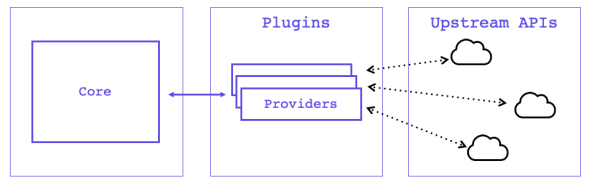

#
Lab: Terraform Plug-in Based Architecture
#
Terraform relies on plugins called “providers” to interact with remote systems and expand functionality. Terraform configurations must declare which providers they require so that Terraform can install and use them. This is performed within a Terraform configuration block.
#

• Task 1: View available Terraform Providers

• Task 2: Install the Terraform AWS Provider

• Task 3: View installed and required providers

#
Task 1: View available Terraform Providers
#
Terraform Providers are plugins that implement resource types for particular clouds, platforms and generally speaking any remote system with an API. Terraform configurations must declare which providers they require, so that Terraform can install and use them. Popular Terraform Providers include: AWS, Azure, Google Cloud, VMware, Kubernetes and Oracle.

For a full list of available Terraform providers, reference the Terraform Provider Registry

#
Task 2: Install the Terraform AWS Provider
#
To install the Terraform AWS provider, and set the provider version in a way that is very similar to how you did for Terraform. To begin you need to let Terraform know to use the provider through a required_providers block in the terraform.tf file as seen below.