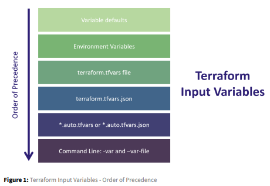

#
Lab: Terraform Input variable And Local Variable Block
#

# Input Variable:

As you being to write Terraform templates with a focus on reusability and DRY development (don’t repeat yourself), you’ll quickly being to realize that variables are going to simplify and increase usability for your Terraform configuration. Input variables allow aspects of a module or configuration to be customized without altering the module’s own source code. This allows modules to be shared between different configurations.  

Input variables (commonly referenced as just ‘variables’) are often declared in a separate file called variables.tf, although this is not required. Most people will consolidate variable declaration in this file for organization and simplification of management. Each variable used in a Terraform configuration must be declared before it can be used. Variables are declared in a variable block - one block for each variable. The variable block contains the variable name, most importantly, and then often includes additional information such as the type, a description, a default value, and other options.  

 

The variable block follows the following pattern:  

 

Declaration: 

 

variable “< VARIABLE_NAME >” { 

# Block body 

type = < VARIABLE_TYPE > 

description = < DESCRIPTION > 

default = < EXPRESSION > 

sensitive = < BOOLEAN > 

validation = < RULES > 

} 

 

Example: 

variable "aws_region" { 

type = string 

description = "region used to deploy workloads" 

default = "us-east-1" 

validation { 

condition = can(regex("^us-", var.aws_region)) 

error_message = "The aws_region value must be a valid region in the 

USA, starting with \"us-\"." 

} 

}

 
The value of a Terraform variable can be set multiple ways, including setting a default value, interactively passing a value when executing a terraform plan and apply, using an environment variable, or setting the value in a .tfvars file. Each of these different options follows a strict order of precedence that Terraform uses to set the value of a variable. 

 

 

• Task 1: Add a new VPC resource block with static values 

• Task 2: Define new variable blocks to declare new variables 

• Task 3: Modify the value of the variable by adding defaults 

 

Task 1: Add a new VPC resource block with static values 

 

Before we can add any meaningful new variables, we should add a new resource to use as a demo. Let’s add a new VPC resource that we’ll use in this lab. In the main.tf file, add the following code at the bottom. Do not remove the existing VPC resource. 

 

resource "aws_subnet" "variable-subnet" { 

  vpc_id = aws_vpc.vpc.id 

  cidr_block = "10.0.0.250/24" 

  availability_zone = "us-east-1a" 

  map_public_ip_on_launch = true 

  tags = { 

    Name = "Variable_subnet" 

    Created_By = "Terraform" 

  } 

} 

 

Run terraform plan to validate the changes to your configuration. You should see that Terraform is going to add a new VPC resource that we just added. 

Once the plan looks good, let’s apply our configuration by issuing a terraform apply 

You will be prompted to confirm the changes before they’re applied. Respond with yes. 

 

Task 2: Define new variable blocks to declare new variables 

 

Now that we have a new resources to use, let’s change some of those static values to use variables instead. In your variables.tf file, add the following variable blocks anywhere in the file: 

 

variable "variable_sub_cidr" { 

  description = "Cird block" 

  type = string 

} 

variable "variable_sub_az" { 

  description = "Availiblity Zone" 

  type = string   

} 

variable "variables_sub_auto_ip" { 

  description = "Set Automatic IP" 

  type = string 

} 

 

In your main.tf file, let’s remove our static values and replace them with our new variables to make our configuration a bit more flexible. Update the configuration file so the new VPC resource reflects the changes shown below: In your main.tf file, let’s remove our static values and replace them with our new variables to make our configuration a bit more flexible. Update the configuration file so the new VPC resource reflects the changes shown below:  

 

resource "aws_subnet" "variable-subnet" { 

  vpc_id = aws_vpc.vpc.id 

  cidr_block = var.variable_sub_cidr 

  availability_zone = var.variable_sub_az 

  map_public_ip_on_launch = var.variables_sub_auto_ip 

  tags = { 

    Name = "Variable_subnet" 

    Created_By = "Terraform" 

  } 

} 

 

We now have new variables declared in our variables.tf file along with a modified resource (our new subnet) to use those variables. Let’s run a terraform plan to see what happens with our new resource and variables. 

 

At this point, we’ve declared the variables and have referenced them in our subnet resource, but Terraform has no idea what value you want to use for the new variables. Let’s provide it with our values. 

• for var.variables_sub_auto_ip, type in “true” and press enter 

• for var.variables_sub_az, type in “us-east-1a” and press enter 

• for var.variables_sub_cidr, type in “10.0.250.0/24” and press enter. 

 

Now that Terraform knows the values we want to use, it can proceed with our configuration. When the terraform plan is completed, it should have found that there are no changes needed to our infrastructure because we’ve defined the same values for our subnet, but using variables instead. 

 

Task 3: Modify the value of the variable by adding defaults 

 

Another common method of providing values for variables is by setting default values in the variable block. If no other values are provided during a terraform plan or terraform apply, then Ter5 raform will use the default values. This is especially handy when you have variables where the value doesn’t often change. In the variables.tf file, modify the new variables we added earlier to now include a default argument and value. 

 

variable "variable_sub_cidr" { 

  description = "Cird block" 

  type = string 

  default = "10.0.254.0/24" 

} 

variable "variable_sub_az" { 

  description = "Availiblity Zone" 

  type = string 

  default = "us-east-1a" 

} 

variable "variables_sub_auto_ip" { 

  description = "Set Automatic IP" 

  type = string 

  default = "true" 

} 

 

Let’s test our new defaults by running another terraform plan. You should see that Terraform no longer asks us for a value for the variables since it will just use the default value if you don’t specify one using another method. And since we provided different values, Terraform wants to update our infrastructure.  

Let’s go ahead and apply our new configuration, which will replace the subnet with one using the CIDR block of “10.0.202.0/24”. Run a terraform apply. Don’t forget to accept the changes by typing yes. 

# Local Variable:

Locals blocks (often referred to as locals) are defined values in Terraform that are used to reduce repetitive references to expressions or values. Locals are very similar to traditional input variables and can be referred to throughout your Terraform configuration. Locals are often used to give a name to the result of an expression to simplify your code and make it easier to read. Locals are not set directly by the user/machine executing the Terraform configuration, and the values don’t change between or during the Terraform workflow (init, plan, apply). Locals are defined in a locals block (plural) and include named local variables with their defined values. Each locals block can contain one or more local variables. Locals are then referenced in your configuration using interpolation using local. (note local and not locals). The syntax of a locals block is as follows:  

Template: 

locals { 

#Block body 

local_variable_name = < EXPRESSION OR VALUE > 

local_variable_name = < EXPRESSION OR VALUE > 

} 

Example:  

locals { 

time = timestamp() 

application = "api_server" 

server_name = "${var.account}-${local.application}" 

• Task 1: Define the Name of an EC2 Instance using a Local Variable 

Task 1: Define the Name of an EC2 Instance using a Local Variable 

Before we can use a locals variable, it needs to be defined in our configuration file. Locals are often defined right in the configuration file where they will be used. In the main.tf file, add the following locals block to the configuration file: 

locals { 

  team        = "mgmt_dev" 

  application = "corp_mgmt" 

  server_name = "gurukul-${var.environment}-${var.variable_sub_az}" 

} 

Next, let’s update the configuration of our web server resource to use the locals variable to define the name. Modify the web_server resource in main.tf so it matches the following: 

resource "aws_instance" "web_server" { 

  ami           = "ami-080e1f13689e07408" 

  instance_type = "t2.micro" 

  subnet_id     = aws_subnet.public_subnets["public_subnet_1"].id 

  tags = { 

    Name        = local.server_name 

    Owner       = local.team 

    Application = local.application 

  } 

} 

Next add the below things in variable.tf file: 

variable "environment" { 

  description = "server environment" 

  type        = string 

  default     = "Development" 

} 

Run a terraform plan to see the changes to our web server. 

Let’s go ahead and commit our code to validate Terraform makes the desired changes to the AWS infrastructure. Run a terraform apply to apply the changes. Log into AWS and validate the changes were applied. Once validated, feel free to remove the locals block and tags on the EC2 instance and then apply the configuration to revert back to the original values. However, you can leave everything in your Terraform configuration if you’d like.  