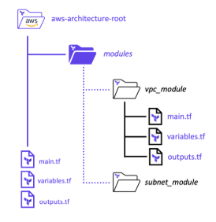

 # The Module Block 

A module is used to combine resources that are frequently used together into a reusable container. Individual modules can be used to construct a holistic solution required to deploy applications. The goal is to develop modules that can be reused in a variety of different ways, therefore reducing the amount of code that needs to be developed. Modules are called by a parent or root module, and any modules called by the parent module are known as child modules. Modules can be sourced from a number of different locations, including remote, such as the Terraform module registry, or locally within a folder. While not required, local modules are commonly saved in a folder named modules, and each module is named for its respective function inside that folder. An example of this can be found in the diagram below:  

 
Modules are defined in a module block with a unique name for each module. Within the module block, the source indicates the local path of the module or the remote source where Terraform should download the module. You can also specify the version of the module to use, along with inputs that are passed to the child module.  

Template 

module “<MODULE_NAME>” { 

# Block body 

source = <MODULE_SOURCE> 

<INPUT_NAME> = <DESCRIPTION> #Inputs 

<INPUT_NAME> = <DESCRIPTION> #Inputs 

} 

Example 

# 

module "website_s3_bucket" { 

source = "./modules/aws-s3-static-website-bucket" 

bucket_name = var.s3_bucket_name 

aws_region = "us-east-1" 

tags = { 

Terraform = "true" 

Environment = "certification" 

} 

} 

# 

• Task 1: Create a new module block to call a remote module  

In order to call a module, let’s create a new module block. In the main.tf file, add the following code: 

# 

module "subnet_addrs" { 

source = "hashicorp/subnets/cidr" 

version = "1.0.0" 

base_cidr_block = "10.0.0.0/22" 

networks = [ 

{ 

name = "module_network_a" 

new_bits = 2 

}, 

{ 

name = "module_network_b" 

new_bits = 2 

}, 

] 

} 

output "subnet_addrs" { 

value = module.subnet_addrs.network_cidr_blocks 

} 

# 

Task 1.1  

Now that we’ve added the new module block, let’s first run a terraform init so Terraform can download the referenced module for us.  

Task 1.2  

Now that the module has been downloaded, let’s apply our new configuration. Keep in mind that this module only calculates subnets for us and returns those subnets as an output. It doesn’t create any resources in AWS. Run a terraform apply -auto-approve to apply the new configuration. 
#

 # The Output Block 

Terraform output values allow you to export structured data about your resources. You can use this data to configure other parts of your infrastructure with automation tools, or as a data source for another Terraform workspace. Outputs are also necessary to share data from a child module to your root module. As with all other blocks in HashiCorp Configuration Language (HCL), the output block has a particular syntax that needs to be followed when creating output blocks. Each output name should be unique. The snytax looks like this: 

Template 
# 

output “<NAME>” { 

# Block body 

value= <EXPRESSION> # Argument 

} 

# 

Example 

#  

output "web_server_ip" { 

description = "Public IP Address of Web Server on EC2" 

value = aws_instance.web_server.public_ip 

sensitive = true 

} 

# 

• Task 1: Add Output Block to Export Attributes of Resources 

• Task 2: Output Meaningful Data using Static and Dynamic Values 

• Task 3: Generate Machine-Readable Outputs in JSON 

Task 1: Add Output Block to Export Attributes of Resources 

In the same working directory that contains our main.tf and variables.tf files, create a new file called `outputs.tf`. This file is commonly used to store all output blocks within your working directory. In the new file, add the following code:  

Task 1.1  

After saving the new `outputs.tf` file, run a `terraform apply -auto-approve` to see our new outputs for our infrastructure.  

Task 2: Output Meaningful Data using Static and Dynamic Values 

Resource attribute data can also be included within a string to include additional information or create a particular output, such as a website URL or database connection string. Modify the outputs.tf file to include the additional output blocks as shown below: 

# 

output "public_url" { 

description = "Public URL for our Web Server" 

value = "https://${aws_instance.web_server.private_ip}:8080/index.html" 

} 

output "vpc_information" { 

description = "VPC Information about Environment" 

value = "Your ${aws_vpc.vpc.tags.Environment} VPC has an ID of ${aws_vpc.vpc.id}" 

} 

# 

Task 2.1 

After saving the new outputs.tffile, run a terraform apply -auto-approveto see our new output. The output now provides a full URL that contains the IP address of our public web server. We also 

have an additional string that provides information about our VPC as well. 

Task 2.2 

If you ever need to read the values of your Terraform outputs but might be nervous about running a terraform apply, you can use the terraform outputcommand to view them. 

Run a terraform outputand view the list of outputs from your configuration: 

Task 3: Generate Machine-Readable Outputs in JSON 

When working with Terraform in your organization, it is common practice to use an automation tool to automate your terraform deployments. But don’t fret! We can still use outputs and make them 

“machine-readable” so other automation tools can parse the information, if needed. 

Run a terraform output -jsonand view the list of outputs in JSON format from your configuration: 